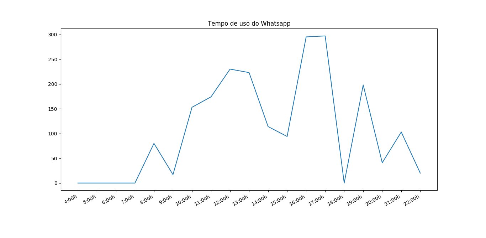
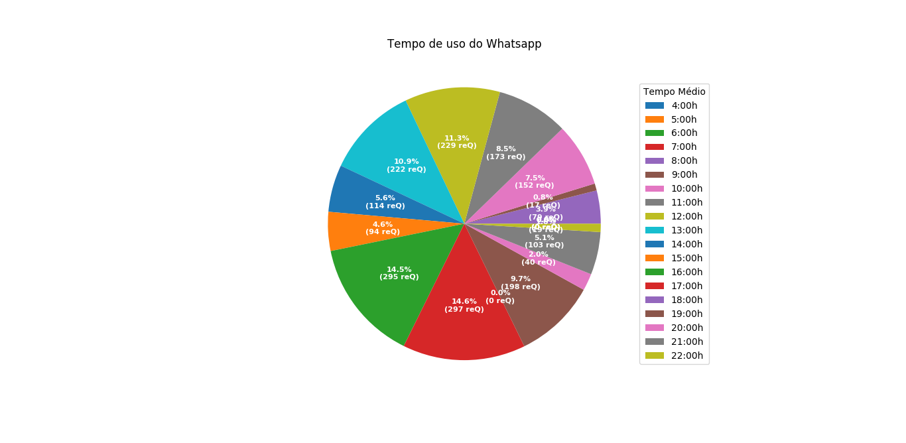

# spyZap
spyzap é uma ferramenta desenvolvida para monitorar atividades de usuários em redes sociais, especificamente o aplicativo WhatsApp, a ferramenta fica ouvindo o privado do usuário e registra os momentos onde aparece Online em seu status.

